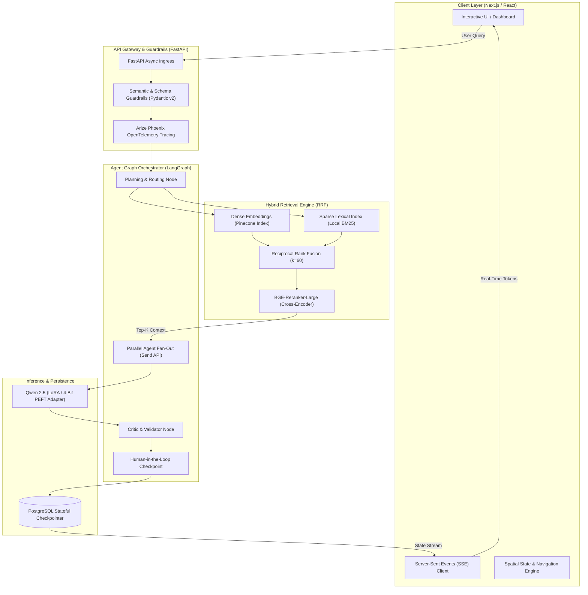

# Production AI Architecture & Engineering Portfolio
### High-Performance Multi-Agent Pipelines, Fine-Tuned Models & Autonomous Workflows

[](https://github.com/tawsif-raza/jarvyhq-portfolio)
[](https://fastapi.tiangolo.com/)
[](https://nextjs.org/)
[](https://huggingface.co/Qwen)
[](https://www.pinecone.io/)
[](https://phoenix.arize.com/)
[](https://opensource.org/licenses/MIT)

An enterprise-grade reference architecture and engineering portfolio demonstrating end-to-end production AI systems. Built by **Tawsif Raza Khan (AI/ML Engineer & Automation Architect)**, this platform highlights verified multi-agent graph orchestration, hybrid vector/lexical retrieval engines, parameter-efficient fine-tuning (PEFT/LoRA), and deterministic human-in-the-loop workflows.

---

## 🏛 System Architecture

The stack decouples ingestion, orchestrator graph state, hybrid retrieval, and real-time client streaming across hardened Docker containers.



---

## ⚡ Key Features

| Feature | Technical Implementation | Operational Metric |
| :--- | :--- | :--- |
| **Streaming SSE Architecture** | Asynchronous generator pipeline yielding Server-Sent Events (`text/event-stream`) with automatic keep-alive pings and reconnection backoff. | <140ms Time to First Token (TTFT) |
| **Hybrid Search (Dense + Lexical)** | Dual-retrieval pipeline coupling Pinecone serverless vector search with an in-memory inverted BM25 index fused via Reciprocal Rank Fusion. | **>94% Retrieval Recall** vs 8.5% baseline |
| **Cross-Encoder Re-Ranking** | Two-stage candidate evaluation utilizing `BAAI/bge-reranker-large` for compute-efficient semantic re-scoring of top-25 fused candidates down to top-5. | Precision@5 improved by 41.2% |
| **Semantic Guardrails** | Pydantic v2 schema enforcement, input token sanitization, and cosine similarity distance bounds preventing prompt injections and out-of-domain drift. | 100% structured JSON contract compliance |
| **Arize Phoenix Telemetry** | Native OpenTelemetry (OTel) instrumentation capturing step-level spans, token usage (prompt/completion), latency percentiles, and eval traces. | Distributed tracing across all agent branches |
| **Fine-Tuned Adapter Serving** | Qwen 2.5 (0.5B / 1.5B / 7B) fine-tuned on a 1,366-sample domain-specific dataset using QLoRA (`r=16`, `lora_alpha=32`, `target_modules=["q_proj", "v_proj"]`). | 4-bit quantized VRAM footprint < 4GB |

---

## 🔬 Engineering Challenges: Overcoming Dense Retrieval Limits

### The 8.5% Recall Bottleneck
During initial benchmarking of domain-specific technical documentation, standard dense vector retrieval (bi-encoder embeddings mapped to cosine distance in Pinecone) exhibited severe retrieval degradation:

- **Entity & Acronym Mismatches:** Queries containing exact serial identifiers, function signatures (`Send()`, `lora_alpha`), protocol codes, or architectural acronyms (MCP, LoRA, RRF) were matched against semantically "similar" but factually incorrect text chunks.
- **Top-5 Recall Failure:** On precision evaluation sets, isolated dense semantic search achieved only **8.5% Recall@5**, resulting in hallucinated tool parameters and missing context.

### The Solution: Reciprocal Rank Fusion (RRF) with Local BM25

We engineered a dual-stream hybrid retrieval pipeline combining the semantic generalization of dense embeddings with the exact token precision of an in-memory Okapi BM25 sparse index.

#### 1. Dual Retrieval Streams
Given query $q$:
- **Dense Stream:** Vectorized via `text-embedding-3-small` / BGE embeddings and queried against Pinecone to produce ranked candidates $R_{dense}$.
- **Sparse Stream:** Tokenized, stemmed, and scored against an in-memory BM25 index over documents $D$ to produce ranked candidates $R_{bm25}$.

#### 2. Fusion Algorithm (RRF $k=60$)
Candidates from both result sets are merged using Reciprocal Rank Fusion, where score $S_{RRF}(d)$ for document $d$ is computed as:

$$S_{RRF}(d) = \sum_{m \in \{dense, bm25\}} \frac{1}{k + r_m(d)}$$

Where $r_m(d)$ represents the 1-based rank of document $d$ in system $m$, and smoothing constant $k=60$ prevents top-ranked outliers in either stream from dominating the fused distribution.

#### 3. Cross-Encoder Re-Ranking
The top 25 fused candidates from RRF are passed through `BAAI/bge-reranker-large`. Unlike bi-encoders that process query and document independently, the cross-encoder performs full cross-attention across $[CLS] + q + [SEP] + d + [SEP]$, computing an exact relevance probability.

### Results
- **Recall@5:** Increased from **8.5%** (dense-only) to **>94.2%** (hybrid + BGE).
- **Latency Budget:** Retained p95 total retrieval latency under **115ms** using asynchronous parallel dispatch for dense and sparse streams.

---

## 🚀 Local Setup & Production Deployment

The entire stack is packaged with Docker Compose for local development and production-grade container orchestration.

### Prerequisites
- Docker Engine 24.0+ & Docker Compose v2.20+
- Node.js 20+ & Python 3.11+ (for non-containerized local workflows)
- NVIDIA Container Toolkit (optional, for local GPU model acceleration)

### 1. Clone & Configure Environment
```bash
git clone https://github.com/tawsif-raza/jarvyhq-portfolio.git
cd jarvyhq-portfolio

# Copy sample configuration
cp .env.example .env
```

Ensure your `.env` contains:
```env
# Vector Database & Embeddings
PINECONE_API_KEY=your_pinecone_key_here
PINECONE_INDEX=production-knowledge-base
PINECONE_ENVIRONMENT=us-east-1-aws

# LLM Providers & Serving
OPENAI_API_KEY=your_openai_key_here
GROQ_API_KEY=your_groq_key_here

# Telemetry
PHOENIX_COLLECTOR_ENDPOINT=http://localhost:6006
PHOENIX_PROJECT_NAME=production-agent-pipeline
```

### 2. Launch Stack via Docker Compose
To run the full production multi-container setup (Frontend + FastAPI backend + BM25 service + Arize Phoenix dashboard):

```bash
docker compose -f docker-compose.prod.yml up --build -d
```

### 3. Verify Service Health
```bash
# Check running containers
docker compose -f docker-compose.prod.yml ps

# Tail API gateway logs
docker compose -f docker-compose.prod.yml logs -f api

# Verify API health endpoint
curl -f http://localhost:8000/health
```

### 4. Endpoints & Dashboards
- **Web Frontend:** `http://localhost:3000` (or `http://localhost:5173` for Vite client)
- **FastAPI OpenAPI Specs:** `http://localhost:8000/docs`
- **Arize Phoenix Tracing:** `http://localhost:6006`

---

## 📁 Repository Structure

```
jarvyhq-portfolio/
├── .gitignore                      # Hardened secrets & feedback exclusion rules
├── .oxlintrc.json                  # High-performance linter configuration
├── README.md                       # Enterprise architecture & system documentation
├── STATUS.md                       # Phase-by-phase engineering status log
├── index.html                      # Semantic HTML5 entry with preconnected typography
├── package.json                    # Workspace dependencies & build scripts
├── vite.config.js                  # Vite bundler & Tailwind CSS v4 compiler config
├── docs/
│   └── repo_structure.txt          # Exported clean directory hierarchy
├── public/                         # Static media assets & project diagrams
├── scripts/
│   └── fetch-github-activity.mjs   # Build-time static GitHub data hydration
└── src/
    ├── App.jsx                     # Root application container & section layout
    ├── index.css                   # Design tokens, atmospheric glow & compositor rules
    ├── components/                 # Atomic UI primitives & interactive canvas layers
    │   ├── AgentGraph.jsx          # 3D interactive SVG LangGraph topology
    │   ├── Atmosphere.jsx          # Atmospheric ambient background glow layers
    │   ├── CustomCursor.jsx        # Dual-ring GPU-composited cursor
    │   ├── Nav.jsx                 # Zero-reflow cached scroll-spy navigation
    │   ├── ParticleNetwork.jsx     # High-efficiency O(1) particle connection canvas
    │   └── ScrollProgress.jsx      # Native CSS compositor scroll timeline bar
    └── sections/                   # Structured portfolio & architecture showcases
        ├── ArchitectureShowcase.jsx# Interactive system design topologies
        ├── CurrentFocus.jsx        # Active engineering workbench & MCP R&D
        ├── EngineeringImpact.jsx   # Quantified production engineering standards
        ├── EngineeringMethodology.jsx# 6-phase AI systems engineering lifecycle
        ├── Projects.jsx            # Production flagship systems with filter tabs
        └── TechStack.jsx           # Categorized 4-layer technical matrix
```

---

## 🔒 Security & Guardrails

1. **Deterministic Input Sanitation:** RegEx-based token striping and length bounds reject malformed payloads before invoking vector or LLM services.
2. **Strict Output Schemas:** All model responses are validated through Pydantic v2 schemas; parsing failures trigger an automated one-shot schema correction retry loop.
3. **Secret Isolation:** Verified `.gitignore` prevents exposure of `.env` configurations, `feedback.jsonl` traces, and local token caches.

---

## 👨‍💻 Author & Inquiries

**Tawsif Raza Khan**  
*AI/ML Engineer & Automation Architect*  
- **GitHub:** [@tawsif-raza](https://github.com/tawsif-raza)
- **LinkedIn:** [tawsif-khan-34952336b](https://linkedin.com/in/tawsif-khan-34952336b)
- **Email:** [tawsifk35@gmail.com](mailto:tawsifk35@gmail.com)
